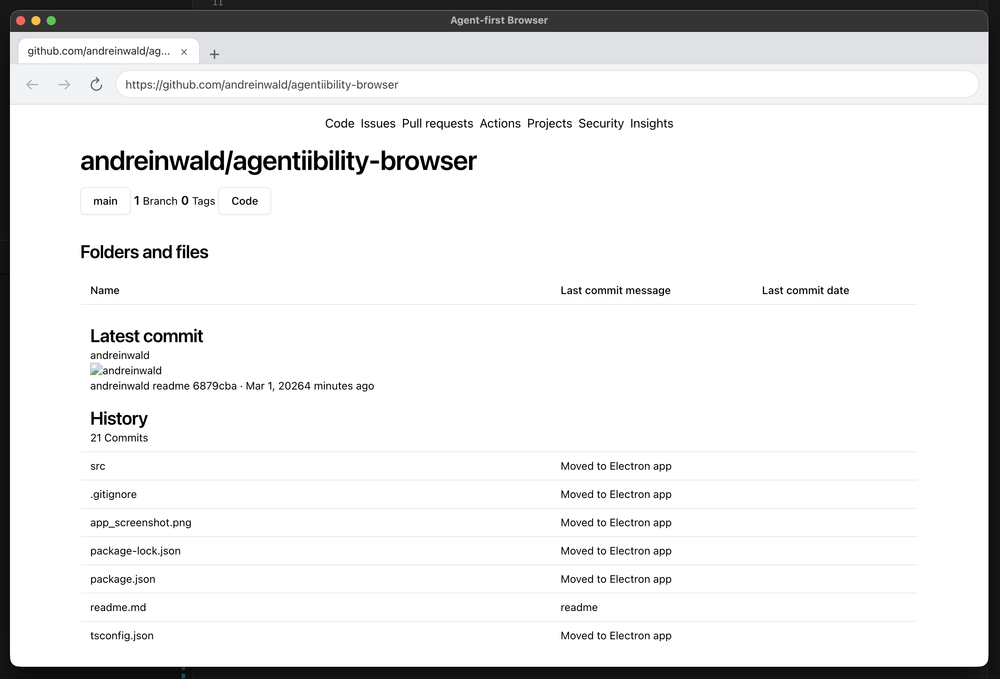

# Agentibility browser - see your website like an AI agent
Desktop app similar to Google Chrome that renders web pages into text format (ARIA) and displays only content that agent can see and interact with.




```bash
npm install
npx playwright install chromium
npm start # opens Electron app
# Enter a URL and press `Go` to load the snapshot view.
```

Build app for macOS or Windows:
```bash
npm run release
```